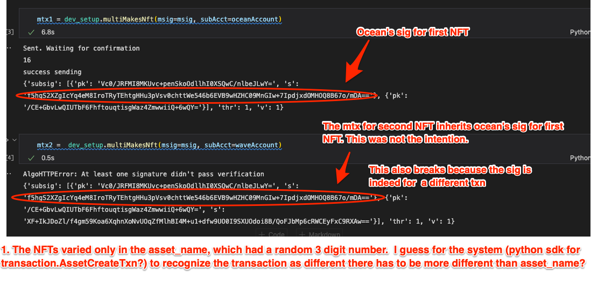
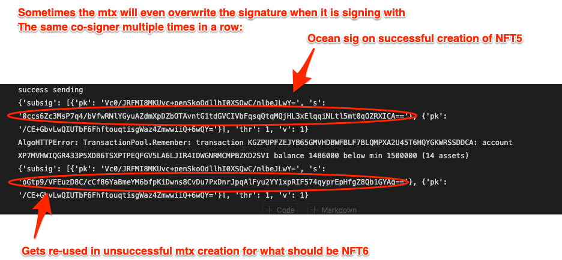

# Multisig Confusion

WANT: Multisig account with two signers, where either one can create NFTs.


ISSUE: it seems that the single signature typically works once and then sporadically. 


`algosdk.error.AlgodHTTPError: At least one signature didn't pass verification`


## Setup to get to issue

1) Make python environment 
    - `python -m venv venv`
    - `source venv/bin/activate`
    - `pip install -r requirements.txt`

2) Run sandbox in local mode `./sandbox up` (i.e. not connected to testnet). The
code expects to fund accounts using the genesis accounts created 
when you do `./sandbox up`. 

2) run `python demo_1.py` and look at the underlying code. This has a quick
fail of first generating an NFT with one co-signer, and then attempting 
to generate a second NFT with the second co-signer. The second NFT signed
transaction _inherits_ the co-signers signature from the first NFT.  See pic below. 
If you can load jupyter notebooks in your IDE, `jupyter_1.ipynb` illustrates
the same issue. Here is a sample output from `jupyter_1.ipynb`:

```

```



```

```

3) In fact repeated signing with the same co-signer also leads to failure, usually
between 3-6 NFTs out. Run `pythnon demo_2.py` or look at `jupyter_2.ipynb` to examine
this. Here is a sample output from `jupyter_2.ipynb`:
```

```



_Note: If you don't do `./sandbox reset` between runs but only reset your IDE, you will keep adding algos to the accounts - this should not be a problem_
